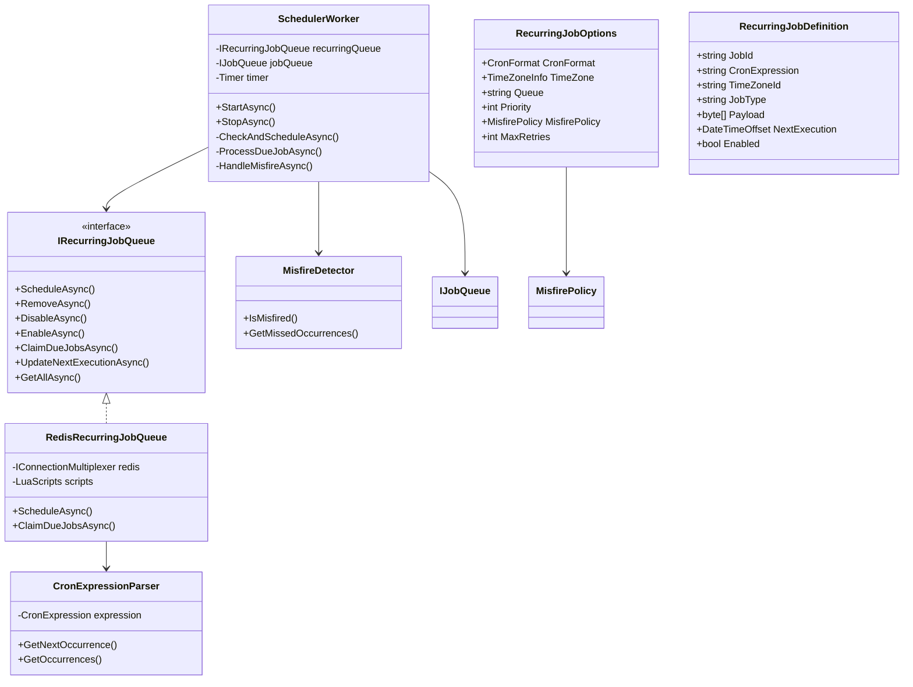
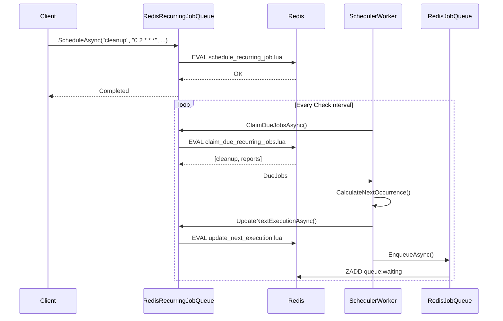

# Valir Tekrarlayan İşler (Recurring Jobs) - Mimari Tasarım

> **Versiyon:** 1.0  
> **Tarih:** Ocak 2026  
> **Durum:** Tasarım Aşaması  
> **Hedef:** Cron desteği ile periyodik iş çalıştırma özelliği

---

## 📋 İçindekiler

1. [Özet ve Hedefler](#1-özet-ve-hedefler)
2. [Cron Parser Stratejisi](#2-cron-parser-stratejisi)
3. [Redis Metadata Yapısı](#3-redis-metadata-yapısı)
4. [Scheduler Worker Mimarisi](#4-scheduler-worker-mimarisi)
5. [Misfire Handling Stratejisi](#5-misfire-handling-stratejisi)
6. [Zaman Dilimi Desteği](#6-zaman-dilimi-desteği)
7. [API Tasarımı](#7-api-tasarımı)
8. [Sınıf Diyagramları](#8-sınıf-diyagramları)

---

## 1. Özet ve Hedefler

### 1.1 Vizyon

Valir'in tekrarlayan işler özelliği, Hangfire ve Quartz.NET ile rekabet edebilecek düzeyde güçlü, ancak Valir'in mevcut Redis tabanlı mimarisine tam entegre bir çözüm sunar.

### 1.2 Hedef API

```csharp
// Cron ifadesi ile zamanlama
tasks.ScheduleRecurring("cleanup", "0 2 * * *", () => CleanupService.Run());

// Yardımcı metodlar ile zamanlama
tasks.ScheduleRecurring("reports", Cron.Daily(9, 0), () => GenerateReports());
tasks.ScheduleRecurring("heartbeat", Cron.EveryMinutes(5), () => SendHeartbeat());

// Zaman dilimi desteği
tasks.ScheduleRecurring("backup", Cron.Daily(2, 0), () => Backup(), 
    TimeZoneInfo.FindSystemTimeZoneById("Europe/Istanbul"));

// Misfire politikası ile
tasks.ScheduleRecurring("sync", Cron.Hourly(), () => SyncData(),
    new RecurringJobOptions 
    { 
        MisfirePolicy = MisfirePolicy.FireOnce,
        MaxRetries = 3 
    });
```

### 1.3 Temel İlkeler

| İlke | Açıklama |
|------|----------|
| **Atomiklik** | Tüm zamanlama operasyonları Lua script'ler ile atomik |
| **Dayanıklılık** | Redis persistence + AOF ile zamanlama garantisi |
| **Ölçeklenebilirlik** | Birden fazla scheduler worker aynı anda çalışabilir |
| **Hata Toleransı** | Misfire handling ve retry mekanizmaları |
| **Basitlik** | Mevcut Valir API'sine tutarlı eklenti |

---

## 2. Cron Parser Stratejisi

### 2.1 Seçenekler Karşılaştırması

| Kriter | NCronTab | Cronos | Özel Implementasyon |
|--------|----------|--------|---------------------|
| **Standart Cron** | ✅ Tam destek | ✅ Tam destek | ✅ 5 alan |
| **Saniye desteği** | ⚠️ Opsiyonel | ✅ Opsiyonel | ✅ Opsiyonel |
| **Özel ifadeler** | ⚠️ Sınırlı | ✅ @daily, @hourly | ✅ @daily, @hourly |
| **L13y** | ⚠️ LGPL | ✅ MIT | ✅ MIT |
| **Boyut** | ~50KB | ~80KB | ~30KB |
| **Bağımlılık** | 1 paket | 0 paket | 0 paket |
| **Performans** | İyi | Mükemmel | İyi |
| **Bakım** | Aktif | Aktif | Tam kontrol |

### 2.2 Öneri: Cronos

**Karar:** [Cronos](https://github.com/HangfireIO/Cronos) kütüphanesi kullanılacak.

**Gerekçeler:**

1. **MIT Lisansı:** LGPL kısıtlamalarından kaçınma
2. **Sıfır Bağımlılık:** Tek DLL, ek paket yönetimi yok
3. **Performans:** Expression tree tabanlı derleme, yüksek performans
4. **Özellik Zenginliği:** Saniye desteği, özel ifadeler (@daily, @hourly, @every_5m)
5. **Kanıtlanmış:** Hangfire tarafından üretilmiş ve kullanılmış
6. **.NET 10 Uyumluluğu:** Modern .NET ile tam uyumlu

### 2.3 Cronos Entegrasyon Tasarımı

```csharp
// Valir.Cron.Internal.CronExpressionParser
internal sealed class CronExpressionParser
{
    private readonly CronExpression _expression;
    
    public CronExpressionParser(string cronExpression, CronFormat format = CronFormat.Standard)
    {
        _expression = CronExpression.Parse(cronExpression, format);
    }
    
    /// <summary>
    /// Bir sonraki çalışma zamanını hesaplar.
    /// </summary>
    public DateTimeOffset? GetNextOccurrence(DateTimeOffset from, TimeZoneInfo? timeZone = null)
    {
        var zone = timeZone ?? TimeZoneInfo.Utc;
        return _expression.GetNextOccurrence(from.UtcDateTime, zone);
    }
    
    /// <summary>
    /// Belirli bir zaman aralığındaki tüm çalışma zamanlarını hesaplar.
    /// </summary>
    public IEnumerable<DateTimeOffset> GetOccurrences(DateTimeOffset from, DateTimeOffset to, TimeZoneInfo? timeZone = null)
    {
        var zone = timeZone ?? TimeZoneInfo.Utc;
        return _expression.GetOccurrences(from.UtcDateTime, to.UtcDateTime, zone)
            .Select(dt => new DateTimeOffset(dt, zone.GetUtcOffset(dt)));
    }
}
```

### 2.4 Cron Yardımcı Sınıfı

```csharp
// Valir.Cron.Cron
public static class Cron
{
    // Standart ifadeler
    public static string Minutely() => "* * * * *";
    public static string Hourly(int minute = 0) => $"{minute} * * * *";
    public static string Daily(int hour = 0, int minute = 0) => $"{minute} {hour} * * *";
    public static string Weekly(DayOfWeek day = DayOfWeek.Monday, int hour = 0, int minute = 0) => 
        $"{minute} {hour} * * {(int)day}";
    public static string Monthly(int day = 1, int hour = 0, int minute = 0) => $"{minute} {hour} {day} * *";
    
    // Özel aralıklar
    public static string EveryMinutes(int minutes) => $"*/{minutes} * * * *";
    public static string EveryHours(int hours) => $"0 */{hours} * * *";
    public static string EveryDays(int days) => $"0 0 */{days} * *";
    
    // İş saatleri
    public static string WeekdaysAt(int hour, int minute = 0) => $"{minute} {hour} * * 1-5";
    public static string WeekendsAt(int hour, int minute = 0) => $"{minute} {hour} * * 0,6";
}
```

---

## 3. Redis Metadata Yapısı

### 3.1 Anahtar Yapısı

Tekrarlayan işler için yeni Redis anahtarları:

```
# Tekrarlayan iş tanımları (Hash)
valir:recurring:{jobId} -> Hash
  - cronExpression: "0 2 * * *"
  - timeZoneId: "Europe/Istanbul"
  - jobType: "CleanupService"
  - payload: "base64..."
  - queue: "default"
  - priority: "0"
  - createdAt: "1704067200000"
  - updatedAt: "1704067200000"
  - nextExecution: "1704153600000"
  - lastExecution: "1704067200000"
  - misfirePolicy: "FireOnce"
  - maxRetries: "3"
  - enabled: "1"

# Tüm tekrarlayan işlerin ID listesi (Set)
valir:recurring:jobs -> Set
  - "cleanup"
  - "reports"
  - "heartbeat"

# Zamanlanmış çalıştırma zamanları (Sorted Set)
# Score: nextExecution timestamp
# Member: jobId
valir:recurring:schedule -> Sorted Set
  - 1704153600000 -> "cleanup"
  - 1704240000000 -> "reports"

# Çalışma geçmişi (Stream - opsiyonel)
valir:recurring:history:{jobId} -> Stream
  - executionId
  - scheduledAt
  - actualAt
  - status: "success|failed|misfired"
  - jobInstanceId: "guid"
```

### 3.2 Lua Script'ler

#### schedule_recurring_job.lua

```lua
-- Tekrarlayan iş tanımlama/güncelleme
-- KEYS[1] = recurring job hash key
-- KEYS[2] = recurring jobs set key
-- KEYS[3] = schedule sorted set key
-- ARGV[1] = jobId
-- ARGV[2] = cronExpression
-- ARGV[3] = timeZoneId
-- ARGV[4] = jobType
-- ARGV[5] = payload
-- ARGV[6] = queue
-- ARGV[7] = priority
-- ARGV[8] = now (timestamp ms)
-- ARGV[9] = nextExecution (timestamp ms)
-- ARGV[10] = misfirePolicy
-- ARGV[11] = maxRetries
-- ARGV[12] = enabled

local jobHashKey = KEYS[1]
local jobsSetKey = KEYS[2]
local scheduleKey = KEYS[3]

-- Store job definition
redis.call('HMSET', jobHashKey,
    'cronExpression', ARGV[2],
    'timeZoneId', ARGV[3],
    'jobType', ARGV[4],
    'payload', ARGV[5],
    'queue', ARGV[6],
    'priority', ARGV[7],
    'createdAt', ARGV[8],
    'updatedAt', ARGV[8],
    'nextExecution', ARGV[9],
    'misfirePolicy', ARGV[10],
    'maxRetries', ARGV[11],
    'enabled', ARGV[12]
)

-- Add to jobs set
redis.call('SADD', jobsSetKey, ARGV[1])

-- Add to schedule sorted set
redis.call('ZADD', scheduleKey, ARGV[9], ARGV[1])

return 1
```

#### claim_due_recurring_jobs.lua

```lua
-- Vadesi gelen tekrarlayan işleri talep et
-- KEYS[1] = schedule sorted set key
-- KEYS[2] = recurring job hash prefix
-- KEYS[3] = lock key prefix
-- KEYS[4] = waiting queue key
-- ARGV[1] = workerId
-- ARGV[2] = now (timestamp ms)
-- ARGV[3] = visibilityTimeoutMs
-- ARGV[4] = batchSize

local scheduleKey = KEYS[1]
local jobHashPrefix = KEYS[2]
local lockKeyPrefix = KEYS[3]
local waitingKey = KEYS[4]
local workerId = ARGV[1]
local now = tonumber(ARGV[2])
local visibilityTimeoutMs = tonumber(ARGV[3])
local batchSize = tonumber(ARGV[4])

-- Get jobs that are due (score <= now)
local dueJobs = redis.call('ZRANGEBYSCORE', scheduleKey, '-inf', now, 'LIMIT', 0, batchSize)
local claimedJobs = {}

for _, jobId in ipairs(dueJobs) do
    local lockKey = lockKeyPrefix .. jobId
    local jobHashKey = jobHashPrefix .. jobId
    
    -- Check if job is enabled
    local enabled = redis.call('HGET', jobHashKey, 'enabled')
    if enabled == "1" then
        -- Try to acquire lock (prevent multiple workers from claiming same job)
        local acquired = redis.call('SET', lockKey, workerId, 'PX', visibilityTimeoutMs, 'NX')
        
        if acquired then
            -- Get job data
            local jobData = redis.call('HMGET', jobHashKey, 
                'jobType', 'payload', 'queue', 'priority', 'misfirePolicy', 'maxRetries')
            
            -- Calculate next execution time
            local cronExpression = redis.call('HGET', jobHashKey, 'cronExpression')
            local timeZoneId = redis.call('HGET', jobHashKey, 'timeZoneId')
            -- Note: Next execution calculation happens in C# code after claiming
            
            table.insert(claimedJobs, {
                jobId = jobId,
                jobType = jobData[1],
                payload = jobData[2],
                queue = jobData[3],
                priority = tonumber(jobData[4]),
                misfirePolicy = jobData[5],
                maxRetries = tonumber(jobData[6])
            })
            
            -- Update last execution
            redis.call('HSET', jobHashKey, 'lastExecution', now)
        end
    end
end

return claimedJobs
```

#### update_next_execution.lua

```lua
-- Bir sonraki çalışma zamanını güncelle
-- KEYS[1] = recurring job hash key
-- KEYS[2] = schedule sorted set key
-- ARGV[1] = jobId
-- ARGV[2] = nextExecution (timestamp ms)
-- ARGV[3] = now (timestamp ms)

local jobHashKey = KEYS[1]
local scheduleKey = KEYS[2]

-- Update next execution in hash
redis.call('HSET', jobHashKey, 'nextExecution', ARGV[2], 'updatedAt', ARGV[3])

-- Update schedule sorted set
redis.call('ZADD', scheduleKey, ARGV[2], ARGV[1])

return 1
```

#### delete_recurring_job.lua

```lua
-- Tekrarlayan iş silme
-- KEYS[1] = recurring job hash key
-- KEYS[2] = recurring jobs set key
-- KEYS[3] = schedule sorted set key
-- KEYS[4] = lock key
-- ARGV[1] = jobId

local jobHashKey = KEYS[1]
local jobsSetKey = KEYS[2]
local scheduleKey = KEYS[3]
local lockKey = KEYS[4]

-- Remove from all structures
redis.call('DEL', jobHashKey)
redis.call('SREM', jobsSetKey, ARGV[1])
redis.call('ZREM', scheduleKey, ARGV[1])
redis.call('DEL', lockKey)

return 1
```

### 3.3 TTL Stratejisi

| Anahtar Tipi | TTL | Gerekçe |
|--------------|-----|---------|
| `valir:recurring:{jobId}` | No TTL | Kalıcı tanım |
| `valir:recurring:jobs` | No TTL | İndeks |
| `valir:recurring:schedule` | No TTL | Zamanlama indeksi |
| `valir:recurring:lock:{jobId}` | 30s | Scheduler worker lock'u |
| `valir:recurring:history:{jobId}` | 7 gün | Opsiyonel, otomatik temizlik |

---

## 4. Scheduler Worker Mimarisi

### 4.1 Bileşen Diyagramı

```mermaid
flowchart TB
    subgraph "Valir.RecurringJobs"
        RC[RecurringJobClient]
        SO[SchedulerOrchestrator]
        SW[SchedulerWorker]
        NJ[NextOccurrenceCalculator]
    end
    
    subgraph "Valir.Redis"
        RJQ[RedisJobQueue]
        RRJQ[RedisRecurringJobQueue]
        LS[LuaScripts]
    end
    
    subgraph "Redis"
        R1[(recurring:jobs)]
        R2[(recurring:schedule)]
        R3[(recurring:{id})]
        R4[(queue:waiting)]
    end
    
    User -->|ScheduleRecurring| RC
    RC -->|Store Definition| RRJQ
    RRJQ -->|Lua Scripts| LS
    LS -->|Write| R1
    LS -->|Write| R2
    LS -->|Write| R3
    
    SO -->|Start/Stop| SW
    SW -->|Claim Due Jobs| RRJQ
    RRJQ -->|Read| R2
    RRJQ -->|Read| R3
    SW -->|Calculate Next| NJ
    SW -->|Enqueue Instance| RJQ
    RJQ -->|ZADD| R4
```

### 4.2 Sınıf Tasarımı

```csharp
// Valir.Abstractions.IRecurringJobQueue
public interface IRecurringJobQueue
{
    /// <summary>
    /// Tekrarlayan iş tanımlar.
    /// </summary>
    Task ScheduleAsync(
        string jobId,
        string cronExpression,
        string jobType,
        byte[] payload,
        RecurringJobOptions? options = null,
        CancellationToken ct = default);
    
    /// <summary>
    /// Tekrarlayan işi siler.
    /// </summary>
    Task RemoveAsync(string jobId, CancellationToken ct = default);
    
    /// <summary>
    /// Tekrarlayan işi geçici olarak devre dışı bırakır.
    /// </summary>
    Task DisableAsync(string jobId, CancellationToken ct = default);
    
    /// <summary>
    /// Tekrarlayan işi etkinleştirir.
    /// </summary>
    Task EnableAsync(string jobId, CancellationToken ct = default);
    
    /// <summary>
    /// Vadesi gelen işleri talep eder (SchedulerWorker tarafından kullanılır).
    /// </summary>
    Task<RecurringJobClaimResult[]> ClaimDueJobsAsync(
        string workerId,
        int batchSize = 10,
        CancellationToken ct = default);
    
    /// <summary>
    /// Bir sonraki çalışma zamanını günceller.
    /// </summary>
    Task UpdateNextExecutionAsync(
        string jobId,
        DateTimeOffset nextExecution,
        CancellationToken ct = default);
    
    /// <summary>
    /// Tüm tekrarlayan işleri listeler.
    /// </summary>
    Task<RecurringJobInfo[]> GetAllAsync(CancellationToken ct = default);
}

// Valir.RecurringJobs.RecurringJobOptions
public sealed class RecurringJobOptions
{
    /// <summary>
    /// Cron format (Standard veya IncludeSeconds). Default: Standard.
    /// </summary>
    public CronFormat CronFormat { get; set; } = CronFormat.Standard;
    
    /// <summary>
    /// Zaman dilimi. Default: UTC.
    /// </summary>
    public TimeZoneInfo? TimeZone { get; set; }
    
    /// <summary>
    /// Hedef kuyruk. Default: "default".
    /// </summary>
    public string Queue { get; set; } = "default";
    
    /// <summary>
    /// İş önceliği. Default: 0.
    /// </summary>
    public int Priority { get; set; } = 0;
    
    /// <summary>
    /// Kaçırılmış iş politikası. Default: FireOnce.
    /// </summary>
    public MisfirePolicy MisfirePolicy { get; set; } = MisfirePolicy.FireOnce;
    
    /// <summary>
    /// Maksimum retry sayısı. Default: 3.
    /// </summary>
    public int MaxRetries { get; set; } = 3;
}

// Valir.RecurringJobs.MisfirePolicy
public enum MisfirePolicy
{
    /// <summary>
    /// Kaçırılan işleri atla, bir sonraki zamanda çalıştır.
    /// </summary>
    Skip,
    
    /// <summary>
    /// Kaçırılan her bir çalışma için ayrı iş oluştur.
    /// </summary>
    FireAll,
    
    /// <summary>
    /// Sadece bir kez çalıştır (varsayılan).
    /// </summary>
    FireOnce,
    
    /// <summary>
    /// Hemen çalıştır, sonra normal zamanlamaya dön.
    /// </summary>
    FireNow
}

// Valir.RecurringJobs.SchedulerWorker
public sealed class SchedulerWorker : IHostedService, IAsyncDisposable
{
    private readonly IRecurringJobQueue _recurringQueue;
    private readonly IJobQueue _jobQueue;
    private readonly ILogger<SchedulerWorker> _logger;
    private readonly SchedulerWorkerOptions _options;
    private readonly string _workerId;
    private Timer? _timer;
    
    public SchedulerWorker(
        IRecurringJobQueue recurringQueue,
        IJobQueue jobQueue,
        IOptions<SchedulerWorkerOptions> options,
        ILogger<SchedulerWorker> logger)
    {
        _recurringQueue = recurringQueue;
        _jobQueue = jobQueue;
        _logger = logger;
        _options = options.Value;
        _workerId = $"scheduler-{Guid.CreateVersion7():N}";
    }
    
    public Task StartAsync(CancellationToken ct)
    {
        _logger.LogInformation("SchedulerWorker {WorkerId} starting", _workerId);
        
        // Periodic check for due jobs
        _timer = new Timer(
            callback: async _ => await CheckAndScheduleAsync(ct),
            state: null,
            dueTime: TimeSpan.Zero,
            period: _options.CheckInterval);
        
        return Task.CompletedTask;
    }
    
    private async Task CheckAndScheduleAsync(CancellationToken ct)
    {
        try
        {
            // Claim due recurring jobs
            var dueJobs = await _recurringQueue.ClaimDueJobsAsync(
                _workerId, 
                _options.BatchSize, 
                ct);
            
            foreach (var job in dueJobs)
            {
                await ProcessDueJobAsync(job, ct);
            }
        }
        catch (Exception ex)
        {
            _logger.LogError(ex, "Error checking for due recurring jobs");
        }
    }
    
    private async Task ProcessDueJobAsync(RecurringJobClaimResult job, CancellationToken ct)
    {
        var now = DateTimeOffset.UtcNow;
        
        // Handle misfires
        if (job.ScheduledAt < now.AddMinutes(-1))
        {
            await HandleMisfireAsync(job, ct);
        }
        else
        {
            // Normal execution - enqueue job instance
            await EnqueueJobInstanceAsync(job, ct);
        }
        
        // Calculate and update next execution
        var nextOccurrence = CalculateNextOccurrence(job, now);
        if (nextOccurrence.HasValue)
        {
            await _recurringQueue.UpdateNextExecutionAsync(
                job.JobId, 
                nextOccurrence.Value, 
                ct);
        }
    }
    
    private async Task HandleMisfireAsync(RecurringJobClaimResult job, CancellationToken ct)
    {
        switch (job.MisfirePolicy)
        {
            case MisfirePolicy.Skip:
                // Do nothing, next execution already calculated
                _logger.LogWarning(
                    "Skipped misfired job {JobId} scheduled at {ScheduledAt}",
                    job.JobId, job.ScheduledAt);
                break;
                
            case MisfirePolicy.FireAll:
                // Enqueue all missed occurrences
                var missedOccurrences = GetMissedOccurrences(job);
                foreach (var occurrence in missedOccurrences)
                {
                    await EnqueueJobInstanceAsync(job, ct, occurrence);
                }
                break;
                
            case MisfirePolicy.FireOnce:
                // Enqueue single job (default behavior)
                await EnqueueJobInstanceAsync(job, ct);
                break;
                
            case MisfirePolicy.FireNow:
                // Enqueue immediately
                await EnqueueJobInstanceAsync(job, ct, DateTimeOffset.UtcNow);
                break;
        }
    }
    
    private async Task EnqueueJobInstanceAsync(
        RecurringJobClaimResult job, 
        CancellationToken ct,
        DateTimeOffset? scheduledAt = null)
    {
        var instanceId = await _jobQueue.EnqueueAsync(
            job.JobType,
            job.Payload,
            delay: null,
            priority: job.Priority,
            ct: ct);
        
        _logger.LogInformation(
            "Enqueued recurring job instance {InstanceId} for {JobId}",
            instanceId, job.JobId);
    }
    
    private DateTimeOffset? CalculateNextOccurrence(RecurringJobClaimResult job, DateTimeOffset from)
    {
        var parser = new CronExpressionParser(job.CronExpression, job.CronFormat);
        return parser.GetNextOccurrence(from, job.TimeZone);
    }
    
    public Task StopAsync(CancellationToken ct)
    {
        _timer?.Change(Timeout.Infinite, 0);
        return Task.CompletedTask;
    }
    
    public ValueTask DisposeAsync()
    {
        _timer?.DisposeAsync();
        return ValueTask.CompletedTask;
    }
}

// Valir.RecurringJobs.SchedulerWorkerOptions
public sealed class SchedulerWorkerOptions
{
    /// <summary>
    /// Kontrol aralığı. Default: 10 saniye.
    /// </summary>
    public TimeSpan CheckInterval { get; set; } = TimeSpan.FromSeconds(10);
    
    /// <summary>
    /// Her kontrolde işlenecek maksimum iş sayısı. Default: 10.
    /// </summary>
    public int BatchSize { get; set; } = 10;
    
    /// <summary>
    /// Aynı anda çalışan scheduler worker sayısı. Default: 1.
    /// </summary>
    public int Concurrency { get; set; } = 1;
}
```

### 4.3 Thread-Safety Stratejisi

| Senaryo | Çözüm |
|---------|-------|
| Birden fazla scheduler aynı işi talep eder | Redis SET NX lock mekanizması |
| Next execution hesaplama yarışı | Lua script atomik güncelleme |
| Job enqueue çakışması | Guid.CreateVersion7() benzersiz ID |
| Worker çöküşü | Lock TTL (30s) + yeni worker devralma |

---

## 5. Misfire Handling Stratejisi

### 5.1 Misfire Senaryoları

```
Normal:    |----|----|----|----|----|
           t1   t2   t3   t4   t5
           
Misfire 1: |----|    |----|----|----|
           t1   t2   t3   t4   t5
                ^
                Scheduler down (t2 kaçırıldı)
                
Misfire 2: |    |    |    |    |----|
           t1   t2   t3   t4   t5
           ^
           Long downtime (t1-t4 kaçırıldı)
```

### 5.2 Politika Davranışları

| Politika | Açıklama | Kullanım Senaryosu |
|----------|----------|-------------------|
| **Skip** | Kaçırılanları atla | Non-critical jobs (log cleanup) |
| **FireAll** | Her kaçırılan için ayrı iş | Audit, billing, idempotent operations |
| **FireOnce** | Tek iş ile devam et | Varsayılan, çoğu senaryo |
| **FireNow** | Hemen çalıştır | Critical recovery jobs |

### 5.3 Misfire Algılama ve İşleme

```csharp
// Valir.RecurringJobs.MisfireDetector
internal sealed class MisfireDetector
{
    /// <summary>
    /// Bir işin misfire olup olmadığını kontrol eder.
    /// </summary>
    public bool IsMisfired(DateTimeOffset scheduledAt, DateTimeOffset now, TimeSpan threshold)
    {
        return scheduledAt < now.Subtract(threshold);
    }
    
    /// <summary>
    /// Kaçırılan tüm çalışma zamanlarını hesaplar.
    /// </summary>
    public List<DateTimeOffset> GetMissedOccurrences(
        string cronExpression,
        TimeZoneInfo? timeZone,
        DateTimeOffset lastExecution,
        DateTimeOffset now)
    {
        var parser = new CronExpressionParser(cronExpression);
        var occurrences = parser.GetOccurrences(lastExecution, now, timeZone);
        
        // Exclude the lastExecution itself
        return occurrences.Where(o => o > lastExecution).ToList();
    }
}
```

### 5.4 Retry Stratejisi

Tekrarlayan işler için retry, enqueue edilen job instance'ları üzerinden çalışır:

```
Recurring Job Definition (cleanup)
    |
    v
SchedulerWorker detects due
    |
    v
Enqueues Job Instance (cleanup-instance-1)
    |
    v
WorkerRuntime processes instance
    |
    +-- Success -> Complete
    +-- Failure -> RetryPolicy -> Requeue
    +-- Max retries exceeded -> Dead letter
    |
    v
Next occurrence calculated
    |
    v
Enqueues Job Instance (cleanup-instance-2)
```

---

## 6. Zaman Dilimi Desteği

### 6.1 UTC vs Local Time

```csharp
// Valir.RecurringJobs.TimeZoneHandler
internal sealed class TimeZoneHandler
{
    /// <summary>
    /// Sistemde mevcut tüm zaman dilimlerini listeler.
    /// </summary>
    public static IEnumerable<TimeZoneInfo> GetAvailableTimeZones()
    {
        return TimeZoneInfo.GetSystemTimeZones();
    }
    
    /// <summary>
    /// Zaman dilimi ID'sine göre TimeZoneInfo bulur.
    /// </summary>
    public static TimeZoneInfo? FindTimeZone(string timeZoneId)
    {
        try
        {
            return TimeZoneInfo.FindSystemTimeZoneById(timeZoneId);
        }
        catch (TimeZoneNotFoundException)
        {
            return null;
        }
    }
    
    /// <summary>
    /// Yerel zamanı UTC'ye dönüştürür.
    /// </summary>
    public static DateTimeOffset ToUtc(DateTimeOffset localTime, TimeZoneInfo timeZone)
    {
        return TimeZoneInfo.ConvertTime(localTime, timeZone, TimeZoneInfo.Utc);
    }
    
    /// <summary>
    /// UTC'yi yerel zamana dönüştürür.
    /// </summary>
    public static DateTimeOffset ToLocal(DateTimeOffset utcTime, TimeZoneInfo timeZone)
    {
        return TimeZoneInfo.ConvertTime(utcTime, TimeZoneInfo.Utc, timeZone);
    }
}
```

### 6.2 Yaz Saati (DST) Yönetimi

```csharp
// Valir.RecurringJobs.DstAwareCalculator
internal sealed class DstAwareCalculator
{
    /// <summary>
    /// DST geçişlerini dikkate alarak bir sonraki çalışma zamanını hesaplar.
    /// </summary>
    public DateTimeOffset? GetNextOccurrenceWithDstHandling(
        CronExpression expression,
        TimeZoneInfo timeZone,
        DateTimeOffset from)
    {
        // Cronos kütüphanesi otomatik olarak DST'yi yönetir
        // Ancak edge case'ler için ek kontroller:
        
        var next = expression.GetNextOccurrence(from.UtcDateTime, timeZone);
        if (!next.HasValue) return null;
        
        var result = new DateTimeOffset(next.Value, timeZone.GetUtcOffset(next.Value));
        
        // DST "gap" kontrolü (ilkbahar, saatler ileri alınır)
        // Eğer hesaplanan zaman DST gap içindeyse, sonraki geçerli zamana atla
        if (timeZone.IsInvalidTime(result.DateTime))
        {
            // Geçersiz zaman - DST gap içinde
            // Bir sonraki geçerli zamanı bul
            var adjusted = result.AddHours(1);
            return GetNextOccurrenceWithDstHandling(expression, timeZone, adjusted);
        }
        
        return result;
    }
}
```

### 6.3 Zaman Dilimi Validasyonu

```csharp
// Valir.RecurringJobs.RecurringJobValidator
internal sealed class RecurringJobValidator
{
    public ValidationResult Validate(RecurringJobDefinition definition)
    {
        var errors = new List<string>();
        
        // Cron expression validation
        if (!CronExpression.IsValid(definition.CronExpression))
        {
            errors.Add($"Invalid cron expression: {definition.CronExpression}");
        }
        
        // TimeZone validation
        if (definition.TimeZoneId is not null)
        {
            try
            {
                TimeZoneInfo.FindSystemTimeZoneById(definition.TimeZoneId);
            }
            catch (TimeZoneNotFoundException)
            {
                errors.Add($"Unknown time zone: {definition.TimeZoneId}");
            }
        }
        
        // Check for ambiguous times (DST "overlap")
        if (definition.TimeZoneId is not null)
        {
            var tz = TimeZoneInfo.FindSystemTimeZoneById(definition.TimeZoneId);
            var nextOccurrence = CalculateNextOccurrence(definition, DateTimeOffset.UtcNow);
            
            if (nextOccurrence.HasValue && tz.IsAmbiguousTime(nextOccurrence.Value.DateTime))
            {
                // Uyarı: Belirsiz zaman - DST overlap
                // Varsayılan olarak standart zamanı kullan
            }
        }
        
        return new ValidationResult(errors);
    }
}
```

---

## 7. API Tasarımı

### 7.1 Extension Metodları

```csharp
// Valir.RecurringJobs.ValirRecurringJobExtensions
public static class ValirRecurringJobExtensions
{
    /// <summary>
    /// Tekrarlayan iş zamanlar.
    /// </summary>
    public static Task ScheduleRecurring(
        this IJobTaskQueue tasks,
        string jobId,
        string cronExpression,
        Expression<Action> job,
        RecurringJobOptions? options = null)
    {
        // Serialize job expression
        var (jobType, payload) = JobSerializer.Serialize(job);
        
        return tasks.RecurringQueue.ScheduleAsync(
            jobId, cronExpression, jobType, payload, options);
    }
    
    /// <summary>
    /// Generic handler ile tekrarlayan iş zamanlar.
    /// </summary>
    public static Task ScheduleRecurring<TJob>(
        this IJobTaskQueue tasks,
        string jobId,
        string cronExpression,
        TJob payload,
        RecurringJobOptions? options = null)
        where TJob : class
    {
        var jobType = typeof(TJob).FullName!;
        var serialized = JsonSerializer.SerializeToUtf8Bytes(payload);
        
        return tasks.RecurringQueue.ScheduleAsync(
            jobId, cronExpression, jobType, serialized, options);
    }
    
    /// <summary>
    /// Tekrarlayan işi siler.
    /// </summary>
    public static Task RemoveRecurring(
        this IJobTaskQueue tasks,
        string jobId)
    {
        return tasks.RecurringQueue.RemoveAsync(jobId);
    }
    
    /// <summary>
    /// Tüm tekrarlayan işleri listeler.
    /// </summary>
    public static Task<RecurringJobInfo[]> GetRecurringJobs(
        this IJobTaskQueue tasks)
    {
        return tasks.RecurringQueue.GetAllAsync();
    }
}
```

### 7.2 DI Kaydı

```csharp
// Valir.RecurringJobs.ServiceCollectionExtensions
public static class RecurringJobServiceCollectionExtensions
{
    public static IServiceCollection AddValirRecurringJobs(
        this IServiceCollection services,
        Action<RecurringJobOptions>? configureOptions = null)
    {
        // Options
        if (configureOptions is not null)
        {
            services.Configure(configureOptions);
        }
        
        // Core services
        services.AddSingleton<IRecurringJobQueue, RedisRecurringJobQueue>();
        services.AddSingleton<NextOccurrenceCalculator>();
        services.AddSingleton<MisfireDetector>();
        
        // Hosted service
        services.AddHostedService<SchedulerWorker>();
        
        return services;
    }
}
```

### 7.3 Kullanım Örnekleri

```csharp
// Program.cs
var builder = WebApplication.CreateBuilder(args);

builder.Services.AddValir(options =>
{
    options.RedisConnectionString = "localhost:6379";
});

builder.Services.AddValirRecurringJobs(options =>
{
    options.CheckInterval = TimeSpan.FromSeconds(30);
    options.BatchSize = 20;
});

var app = builder.Build();

// Tekrarlayan iş tanımlama
var tasks = app.Services.GetRequiredService<IJobTaskQueue>();

// Basit kullanım
await tasks.ScheduleRecurring("cleanup", "0 2 * * *", () => Cleanup());

// Zaman dilimi ile
await tasks.ScheduleRecurring("reports", Cron.Daily(9, 0), () => GenerateReports(),
    new RecurringJobOptions 
    { 
        TimeZone = TimeZoneInfo.FindSystemTimeZoneById("Europe/Istanbul"),
        Queue = "reports",
        Priority = 5
    });

// Misfire politikası ile
await tasks.ScheduleRecurring("sync", Cron.EveryMinutes(5), () => SyncData(),
    new RecurringJobOptions 
    { 
        MisfirePolicy = MisfirePolicy.FireAll,
        MaxRetries = 5
    });

// Generic handler
await tasks.ScheduleRecurring("email-digest", Cron.Daily(8, 0),
    new EmailDigestJob { Template = "daily", Recipients = ["user@example.com"] });
```

---

## 8. Sınıf Diyagramları

### 8.1 Genel Mimari



### 8.2 Veri Akışı



### 8.3 Paket Yapısı

```
Valir/
├── src/
│   ├── Valir.Abstractions/
│   │   └── IRecurringJobQueue.cs
│   ├── Valir.Core/
│   │   └── RecurringJobOptions.cs
│   ├── Valir.Cron/
│   │   ├── Cron.cs
│   │   └── Internal/
│   │       └── CronExpressionParser.cs
│   ├── Valir.RecurringJobs/
│   │   ├── SchedulerWorker.cs
│   │   ├── SchedulerWorkerOptions.cs
│   │   ├── MisfireDetector.cs
│   │   ├── MisfirePolicy.cs
│   │   ├── RecurringJobDefinition.cs
│   │   ├── TimeZoneHandler.cs
│   │   └── ServiceCollectionExtensions.cs
│   └── Valir.Redis/
│       ├── RedisRecurringJobQueue.cs
│       └── Scripts/
│           ├── schedule_recurring_job.lua
│           ├── claim_due_recurring_jobs.lua
│           ├── update_next_execution.lua
│           └── delete_recurring_job.lua
```

---

## 9. Karar Özeti

| Konu | Karar | Gerekçe |
|------|-------|---------|
| **Cron Parser** | Cronos | MIT lisansı, sıfır bağımlılık, yüksek performans |
| **Redis Yapısı** | Hash + Sorted Set + Set | Mevcut mimariye uyum, atomik Lua operasyonları |
| **Scheduler** | HostedService + Timer | .NET standartları, graceful shutdown desteği |
| **Misfire** | 4 politika (Skip/FireAll/FireOnce/FireNow) | Esneklik, farklı senaryolar |
| **TimeZone** | TimeZoneInfo + Cronos DST | Standart .NET, otomatik DST yönetimi |
| **Locking** | Redis SET NX | Dağıtık ortamda güvenli, basit |
| **Next Calc** | C# kodunda (Lua'da değil) | Cronos entegrasyonu, test edilebilirlik |

---

## 10. Gelecek Geliştirmeler

| Özellik | Öncelik | Açıklama |
|---------|---------|----------|
| Job Chaining | Medium | Bir işin tamamlanmasından sonra diğerini tetikleme |
| Calendar Exclusions | Low | Tatil günlerini hariç tutma |
| Execution History | Low | Detaylı çalışma geçmişi ve metrikler |
| Pause/Resume | Medium | Belirli bir süreliğine duraklatma |
| Dynamic Rescheduling | Low | Runtime'da cron ifadesi değiştirme |
