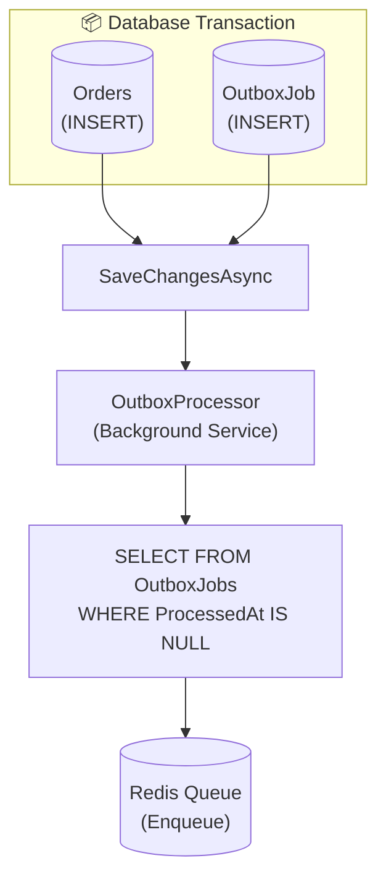

# Transactional Outbox

The Transactional Outbox pattern ensures jobs are created atomically with your database transaction.

## Problem

Without the outbox pattern, you risk:

```csharp
// ❌ DANGEROUS: Not atomic!
await _context.Orders.AddAsync(order);
await _context.SaveChangesAsync();  // ✅ Committed

await _jobQueue.EnqueueAsync("process-order", payload);  // ❌ Might fail!
```

If the job enqueue fails after the database commit, you have an inconsistent state.

## Solution

The Outbox pattern writes jobs to the same database transaction:

```csharp
// ✅ SAFE: Atomic!
await _context.Orders.AddAsync(order);
await _outboxQueue.EnqueueAsync("process-order", payload);  // Writes to outbox table
await _context.SaveChangesAsync();  // Both committed together

// Background processor pushes to Redis later
```

## Installation

```bash
dotnet add package Valir.EntityFrameworkCore
```

## Setup

### 1. Configure DbContext

```csharp
public class AppDbContext : DbContext
{
    public DbSet<Order> Orders { get; set; }
    public DbSet<OutboxJob> OutboxJobs { get; set; }

    protected override void OnModelCreating(ModelBuilder modelBuilder)
    {
        // Configure Valir outbox
        modelBuilder.ConfigureValirOutbox();
        
        // Your other configurations...
    }
}
```

### 2. Register Services

```csharp
builder.Services.AddDbContext<AppDbContext>(options =>
    options.UseNpgsql(connectionString));

// Add Redis job queue (required)
builder.Services.AddValir(options =>
{
    options.RedisConnectionString = "localhost:6379";
});

// Add outbox pattern
builder.Services.AddValirOutbox<AppDbContext>();
```

### 3. Run Migrations

```bash
dotnet ef migrations add AddValirOutbox
dotnet ef database update
```

## Usage

Inject `OutboxJobQueue` instead of `IJobQueue`:

```csharp
public class OrderService
{
    private readonly AppDbContext _context;
    private readonly OutboxJobQueue _outbox;

    public async Task CreateOrderAsync(CreateOrderRequest request)
    {
        var order = new Order
        {
            Id = Guid.NewGuid(),
            CustomerId = request.CustomerId,
            Items = request.Items,
            Status = OrderStatus.Pending
        };

        // Add to database
        _context.Orders.Add(order);
        
        // Add job to outbox (same transaction)
        var payload = JsonSerializer.SerializeToUtf8Bytes(new { OrderId = order.Id });
        await _outbox.EnqueueAsync("process-order", payload);
        
        // Single atomic commit
        await _context.SaveChangesAsync();
    }
}
```

## How It Works



## OutboxJob Schema

```sql
CREATE TABLE outbox_jobs (
    id UUID PRIMARY KEY,
    job_type VARCHAR(255) NOT NULL,
    queue VARCHAR(255) NOT NULL DEFAULT 'default',
    payload BYTEA NOT NULL,
    priority INT NOT NULL DEFAULT 0,
    idempotency_key VARCHAR(255),
    delay_until TIMESTAMP WITH TIME ZONE,
    created_at TIMESTAMP WITH TIME ZONE NOT NULL,
    processed_at TIMESTAMP WITH TIME ZONE,
    error TEXT
);

CREATE INDEX ix_outbox_pending ON outbox_jobs (created_at) 
    WHERE processed_at IS NULL;
```

## Configuration

```csharp
builder.Services.AddValirOutbox<AppDbContext>(options =>
{
    options.BatchSize = 100;              // Jobs per batch
    options.PollingInterval = TimeSpan.FromSeconds(5);
    options.MaxRetries = 3;               // Retry failed pushes
    options.RetentionPeriod = TimeSpan.FromDays(7);  // Cleanup period
});
```

## Error Handling

If Redis is temporarily unavailable:

1. Jobs remain in the outbox table
2. `OutboxProcessor` retries on next poll
3. After `MaxRetries`, job is marked with error
4. Manual intervention or cleanup policy applies

## Best Practices

1. **Keep payloads small** — Store IDs, not full objects
2. **Use idempotency keys** — Prevent duplicate processing
3. **Monitor outbox size** — Alert if growing unexpectedly
4. **Clean up old jobs** — Use retention policy

## Cleanup

Processed jobs can be cleaned up:

```csharp
// In a scheduled job
await _context.OutboxJobs
    .Where(j => j.ProcessedAt != null && 
                j.ProcessedAt < DateTime.UtcNow.AddDays(-7))
    .ExecuteDeleteAsync();
```
